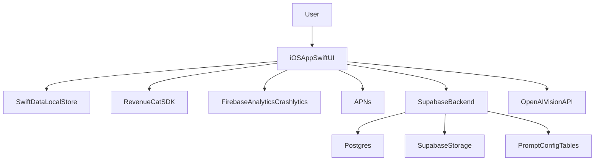

# AI Sourdough Coach iOS MVP Roadmap

## 1) Recommended Technology Stack
- **UI**: SwiftUI + NavigationStack
  - Fastest for solo iOS development, minimal boilerplate, easy iteration.
- **Local storage**: SwiftData (primary local cache) + Keychain (tokens)
  - Native Apple stack, no extra dependency, enough for local read performance.
- **Cloud database**: Supabase Postgres
  - Lowest ops burden for auth + DB + storage in one place; SQL clarity and future portability.
- **Authentication**: Supabase Auth (email + Apple Sign In)
  - Covers required account flow with minimal backend code.
- **Image storage**: Supabase Storage buckets (`starter-images`, `loaf-images`)
  - Cheap, simple signed URLs, integrated RLS.
- **AI provider**: OpenAI vision model (single provider for MVP)
  - Best speed/quality trade-off with structured JSON output support.
- **Push notifications**: Native APNs
  - One less dependency; enough for MVP reminder delivery.
- **Analytics + crash reporting**: Firebase Analytics + Crashlytics
  - Lowest setup effort for event tracking and production crash visibility.
- **Subscription SDK**: RevenueCat
  - Easiest way to manage monthly/yearly plans, trials, entitlement logic.
- **CI/CD**: Manual archive/TestFlight initially, optional GitHub Actions later
  - Fastest path for a solo founder; automate only after release cadence grows.
- **App Store deployment**: App Store Connect + TestFlight + Fastlane only if needed later
  - Keep release process simple at first; automate only when cadence increases.

## 2) MVP Scope (Strict)
- **Included only**
  - User account
  - Starter profile (name, hydration preference optional, timezone)
  - Starter photo scan
  - AI analysis result
  - Feeding log
  - AI next-step recommendation
  - Room temperature input
  - Bake journal
  - Loaf scan
  - Previous bake comparison
  - Push reminders
  - Recipe import (URL or screenshot -> AI extraction)
  - Monthly + yearly subscription paywall
- **Deferred (post-MVP)**
  - Social/community, leaderboard, sharing templates
  - Advanced recipe generator
  - Multi-starter household collaboration
  - Wearables/widget/live activities
  - Custom model fine-tuning

## 3) System Architecture (Simple, Modular)

- **Core client modules**
  - `AuthModule`: sign-in, session refresh.
  - `ScanModule`: camera capture, image compression, upload.
  - `ImageQualityModule`: blur/darkness checks before AI call.
  - `CoachModule`: AI requests/results display.
  - `JournalModule`: feeding + bake logs.
  - `RecipeImportModule`: URL/screenshot parsing into structured recipe fields.
  - `ReminderModule`: notification preferences and scheduling events.
  - `BillingModule`: paywall + entitlement check.
- **Data flow**
  - User action -> cloud write (Supabase) -> local refresh cache (SwiftData) for fast reads.
- **AI request flow**
  - Quality check -> upload image -> fetch active AI config (model + prompt_version) -> call AI provider with image URL + history summary -> validate strict JSON -> persist analysis + recommendation -> render explanation to user.
  - Optional: route via lightweight backend proxy only if API key protection or central throttling is needed.
- **Image upload flow**
  - Capture -> quality gate (blur/dark) -> compress to capped resolution -> upload to storage bucket -> store object path + signed read URL.
- **Notification flow**
  - App registers APNs token -> saves token + reminder preferences + timezone -> backend schedules reminder records -> app-triggered local scheduling or backend-triggered APNs send.
- **Offline strategy**
  - V1 requires internet for scans and AI recommendations.
  - If offline, app shows explicit retry state and does not queue background sync.
- **Error handling**
  - User-friendly error categories: `network`, `auth`, `ai_timeout`, `invalid_ai_response`, `upload_failed`.
  - Retry with backoff for network/AI; never silently drop user logs.

## 4) Database Design (MVP Only)

- **`users`** (purpose: profile metadata beyond auth)
  - `id` (uuid, PK, matches auth uid)
  - `created_at` (timestamptz)
  - `timezone` (text)
  - `display_name` (text, nullable)
  - `apns_token` (text, nullable)
  - Indexes: PK only

- **`subscriptions`** (purpose: cached entitlement state)
  - `user_id` (uuid, PK/FK -> users.id)
  - `provider` (text, default `revenuecat`)
  - `entitlement_active` (bool)
  - `plan_type` (text: monthly/yearly)
  - `expires_at` (timestamptz, nullable)
  - `updated_at` (timestamptz)
  - Indexes: `entitlement_active`, `expires_at`

- **`starters`** (purpose: starter profile)
  - `id` (uuid, PK)
  - `user_id` (uuid, FK -> users.id)
  - `name` (text)
  - `created_at` (timestamptz)
  - `active` (bool)
  - Indexes: `(user_id, active)`

- **`feeding_logs`** (purpose: starter timeline)
  - `id` (uuid, PK)
  - `user_id` (uuid, FK)
  - `starter_id` (uuid, FK -> starters.id)
  - `logged_at` (timestamptz)
  - `room_temp_c` (numeric(4,1))
  - `flour_g` (int, nullable)
  - `water_g` (int, nullable)
  - `starter_g` (int, nullable)
  - `notes` (text, nullable)
  - Indexes: `(starter_id, logged_at desc)`, `(user_id, logged_at desc)`

- **`bakes`** (purpose: bake journal entries)
  - `id` (uuid, PK)
  - `user_id` (uuid, FK)
  - `created_at` (timestamptz)
  - `title` (text)
  - `notes` (text, nullable)
  - `room_temp_c` (numeric(4,1), nullable)
  - Indexes: `(user_id, created_at desc)`

- **`scans`** (purpose: image scan metadata)
  - `id` (uuid, PK)
  - `user_id` (uuid, FK)
  - `starter_id` (uuid, nullable FK)
  - `bake_id` (uuid, nullable FK)
  - `scan_type` (text: starter/loaf)
  - `storage_path` (text)
  - `created_at` (timestamptz)
  - `status` (text: uploaded/analyzed/failed)
  - `quality_score` (numeric(3,2), nullable)
  - `quality_issue` (text, nullable)
  - Indexes: `(user_id, created_at desc)`, `(starter_id, created_at desc)`, `(bake_id, created_at desc)`

- **`ai_analyses`** (purpose: structured AI result + recommendation)
  - `id` (uuid, PK)
  - `scan_id` (uuid, unique FK -> scans.id)
  - `user_id` (uuid, FK)
  - `model` (text)
  - `prompt_version` (text)
  - `confidence` (numeric(3,2))
  - `analysis_json` (jsonb)
  - `rendered_explanation` (text)
  - `created_at` (timestamptz)
  - Indexes: `(user_id, created_at desc)`, `GIN(analysis_json)` optional later

- **`starter_states`** (purpose: current inferred starter condition for coaching memory)
  - `starter_id` (uuid, PK/FK -> starters.id)
  - `user_id` (uuid, FK)
  - `state_label` (text)
  - `updated_from_scan_id` (uuid, FK -> scans.id)
  - `updated_at` (timestamptz)
  - Indexes: `(user_id, updated_at desc)`

- **`recommendations`** (purpose: recommendation history + outcomes)
  - `id` (uuid, PK)
  - `user_id` (uuid, FK)
  - `scan_id` (uuid, FK -> scans.id)
  - `recommendation` (text)
  - `due_at` (timestamptz, nullable)
  - `completed_at` (timestamptz, nullable)
  - `outcome` (text: followed/helpful/not_helpful/skipped/unknown)
  - `created_at` (timestamptz)
  - Indexes: `(user_id, created_at desc)`, `(scan_id)`, `(due_at)`

- **`ai_runtime_configs`** (purpose: feature flags for prompt/model switching without release)
  - `id` (uuid, PK)
  - `active` (bool)
  - `scan_type` (text: starter/loaf/recipe)
  - `model` (text)
  - `prompt_version` (text)
  - `temperature` (numeric(2,1), default 0.2)
  - `updated_at` (timestamptz)
  - Indexes: `(active, scan_type)`

- **`reminders`** (purpose: push reminder settings)
  - `id` (uuid, PK)
  - `user_id` (uuid, FK)
  - `starter_id` (uuid, nullable FK)
  - `reminder_type` (text: feed/checkin/bake_followup)
  - `hour_local` (smallint)
  - `minute_local` (smallint)
  - `enabled` (bool)
  - `updated_at` (timestamptz)
  - Indexes: `(user_id, enabled)`

- **Relationships**
  - User has many starters, feeding_logs, bakes, scans, reminders, recommendations.
  - Scan has one AI analysis.
  - Starter has one current `starter_state`, updated by latest meaningful scan.
  - Recommendations are linked to scans and later enriched with `completed_at` and `outcome`.
  - Loaf comparison uses latest loaf scan vs previous loaf scan by same user.

## 5) AI Architecture
- **Prompt structure**
  - System: strict role as sourdough coach, safety/uncertainty behavior, JSON-only output.
  - Developer: rubric for starter/loaf cues, required fields, recommendation constraints.
  - User payload: image URL + recent history summary + room temp + latest logs + current starter state + unresolved recommendations.
- **Prompt versioning**
  - Every request uses `prompt_version` from `ai_runtime_configs`.
  - Persist `prompt_version` on each analysis and recommendation for later evaluation.
- **JSON schema (strict)**
  - `scan_type`: `starter|loaf`
  - `observations`: array of short factual observations
  - `diagnosis`: enum-like label list
  - `confidence`: 0.0-1.0
  - `next_steps`: ordered array with time windows
  - `human_explanation`: concise plain-language explanation shown to user
  - `risk_flags`: array
  - `compare_to_previous`: object with changed/not_changed and explanation
- **Confidence score policy**
  - Use model confidence plus rule-based down-weighting if image quality low or signals conflict.
- **Retry strategy**
  - 1 immediate retry on timeout/5xx.
  - 1 repair call if JSON invalid (prompt: "fix to schema exactly").
  - Then fail gracefully.
- **Fallback behavior**
  - Show safe generic guidance by scan type when AI unavailable.
  - Save scan for later re-analysis.
- **History injection**
  - Include compact summary of last 3 feeding logs, last 2 scans, current starter state, open recommendations, and recent recommendation outcomes.
  - Token cap guardrail to control cost/latency.
- **Hallucination minimization**
  - Force structured output.
  - Prompt asks for visible evidence only; prohibit hidden assumptions.
  - Post-validate JSON and reject impossible values.
  - Never let AI write directly to mutable records without validation.

## 6) Implementation Roadmap (Large Practical Phases)

### Phase A — Foundation & Monetization (S)
- **Objective**: make app installable, account-based, and paywalled.
- **Deliverables**: SwiftUI shell, auth, onboarding, RevenueCat paywall, analytics/crash setup.
- **Dependencies**: App Store Connect products + RevenueCat project.
- **Acceptance criteria**: user can sign up, see paywall, purchase monthly/yearly, entitlement unlocks app.

### Phase B — Starter Workflow (M)
- **Objective**: deliver core starter value loop.
- **Deliverables**: starter profile, feeding log, room temp capture, starter scan upload, image quality gate, AI analysis + next step card, recommendation tracking (`due_at`, `outcome`), current starter state updates.
- **Dependencies**: storage bucket, DB tables, optional AI proxy only if key protection is required.
- **Acceptance criteria**: user can log feeding, scan starter, receive recommendation, mark outcome, and see memory-aware follow-up.

### Phase C — Bake Journal + Loaf Coaching (M)
- **Objective**: extend loop from starter to bake outcomes.
- **Deliverables**: bake entries, loaf scans, AI loaf analysis, previous bake comparison.
- **Dependencies**: phase B data model and AI schema extension.
- **Acceptance criteria**: user can record bake, scan loaf, and see what improved/regressed vs previous.

### Phase D — Retention & Reliability (S)
- **Objective**: reminders and production hardening for launch.
- **Deliverables**: APNs registration, reminder preferences + scheduling, error states, TestFlight polish.
- **Dependencies**: APNs credentials, app token registration.
- **Acceptance criteria**: reminders fire correctly by timezone; failed uploads/AI calls show clear retry path; no P0 crashes in beta.

### Phase E — Launch & Learn (S)
- **Objective**: ship and iterate on funnel.
- **Deliverables**: App Store submission, dashboards, cohort baseline, first conversion experiments.
- **Dependencies**: stable crash rate + analytics events.
- **Acceptance criteria**: approved release, funnel visible (install->scan->recommendation->subscribe), weekly iteration cadence.

## 7) Essential Testing Plan
- **Unit tests (now)**
  - Recommendation mapping logic, confidence down-weight rules, outcome/state transition rules.
- **Integration tests (now)**
  - Auth session restore, upload -> analysis -> recommendation persistence pipeline, reminder save/reload.
- **AI response validation (now)**
  - Schema validator tests with valid/invalid payload fixtures.
- **Image upload tests (now)**
  - Compression threshold + upload retry + signed URL read path.
- **Subscription tests (now)**
  - Purchase, restore purchase, entitlement expiration handling.
- **End-to-end happy path (now)**
  - New user -> subscribe -> starter scan -> recommendation -> feeding log -> loaf scan comparison.
- **Can wait until post-launch**
  - Full UI snapshot suite, extensive edge-case fuzzing, large device matrix automation.

## 8) Minimum Analytics (Only What Matters)
- **Provider**
  - Firebase Analytics (single analytics provider for MVP).
- **Activation**
  - `signup_completed`
  - `starter_created`
  - `first_scan_uploaded`
  - `first_ai_recommendation_viewed`
  - `first_recommendation_marked_outcome`
- **Retention**
  - `feeding_logged`
  - `push_opened`
  - `scan_repeated_within_7d`
  - `bake_logged`
- **Subscription**
  - `paywall_viewed`
  - `trial_started` (if used)
  - `purchase_completed`
  - `subscription_renewed`
  - `subscription_canceled`

## 9) Biggest Technical Risks + Mitigations
- **AI inconsistency on low-quality images**
  - Mitigation: in-app capture guide + quality checks + confidence gating + safe fallback text.
- **Rising AI/storage costs**
  - Mitigation: compress images, cap scan frequency for free users, token-limited history summaries.
- **Subscription edge cases (restore/expired/intro offers)**
  - Mitigation: RevenueCat as source of truth + dedicated integration tests.
- **Notification reliability across timezones**
  - Mitigation: persist timezone and local reminder time; deterministic APNs scheduling and periodic token refresh.
- **Solo-founder maintenance overload**
  - Mitigation: one provider per category, strict module boundaries, avoid custom backend microservices.

## 10) Recommended Build Order
1. App shell + auth + paywall (prove monetization path first).
2. Starter profile + feeding log + room temp.
3. Image upload + AI analysis + recommendation UI.
4. Bake journal + loaf scan + previous comparison.
5. Push reminders + reliability polish (no offline sync queue in V1).
6. TestFlight beta, fix top friction points from analytics, then App Store launch.

## Cost and Simplicity Defaults
- Start with one environment (production-like) plus local debug.
- Keep one AI model for both starter/loaf in MVP.
- Use direct AI calls for speed; add minimal proxy only for API-key protection/throttling.
- Prefer SQL migrations and explicit schemas over ORM abstraction layers.
